# An Introduction to the AT Protocol

*9th June, 2025*


For many years, social media platforms such as Facebook and Twitter operated as walled gardens. These platforms built closed ecosystems where all infrastructure was centralized. They controlled user identities, stored all posts and interactions, and hosted the servers responsible for displaying content - even beyond their platforms, such as in news site embeds. As a result, users had no real ownership over their data or online presence, and the platforms could lock users in while harvesting their personal data for commercial gain.

The **AT Protocol (Authenticated Transfer Protocol, or ATProto)** is an open, decentralized social media protocol designed to dismantle this monopoly model. It breaks the traditional social network into modular components that can be independently hosted and governed. This architecture ensures user autonomy, interoperability, and competition. On a high-level the key goal of this architecture is *not* to enable a monopolistic platform play and subsequent [enshittification](https://en.m.wikipedia.org/wiki/Enshittification).

## Core Components of ATProto

ATProto is built on **4** key components:

#### 1. **PLC Directory (Personal Ledger Certificates)**
Every user needs an identity. In ATProto, identity creation happens via the PLC Directory - a public registry similar to a digital phone book. It stores each user’s unique ATProto identifier, chosen handle (e.g. @jay.bsky.team), cryptographic key (so that everyone can verify your posts are really created by you), and a link to where their data is hosted (your PDS). Currently, the main PLC Directory is hosted by Bluesky. However, there are plans to move it under the stewardship of a neutral entity in a politically neutral jurisdiction. This ensures long-term trust, neutrality, and independence.

**Example:**
| Handle | ATProto Identifier | Cryptographic Key | Data Host Location |
|--------|-------------------|-------------------|-------------------|
| @seabass | did:plc:bafyrei7x2... | pk_abc123def456... | bsky.social |
| @alice.dev | did:plc:bafyrei9k8... | pk_xyz789ghi012... | my-pds.com |
| @bob | did:plc:bafyrei2m4... | pk_mno345pqr678... | personal-server.net |
| ...


#### 2. **Personal Data Servers (PDS)**

A PDS is a server that stores the actual content created by users: posts, likes, comments, follows, and more. Each PDS can host one or many users. Crucially, the data remains under the control of the user. You can choose to self-host a PDS at home, rent a server, or let a provider such as Bluesky host it for you. And if you’re unhappy with your provider, you can move your data to another PDS - just like changing email providers. As of now, there are around 2,000 PDSs in operation, though the majority of users still rely on large-scale PDSs hosted by Bluesky.

One could build a social network already with only these two components by simply letting users follow users on other PDSs and synchronize the posts that are of interest between PDSs. This is in a nutshell how Mastodon / ActivityPub operates. Apart from the centralization drawbacks, there are some technical issues with this architecture as well. For example,when trying to implement a search across the entire network: by default users on Mastodon can only search posts on their own “PDS”.

```mermaid
graph TD
    PLC[PLC Directory<br/>Identity Registry]

    subgraph graph1 ["Personal Data Servers (PDS)"]
        PDS1[Bluesky PDS<br/>🏢 Large Scale<br/>Hosts: @alice, @bob, @charlie]
        PDS2[Self-Hosted PDS<br/>🏠 Home Server]
        PDS3[Rented Server PDS<br/>☁️ Cloud Provider]
        PDS4[Community PDS<br/>🤝 Shared Hosting]
        PDS5[Corporate PDS<br/>🏢 Enterprise]
    end

    subgraph graph2 ["User Data Examples"]
        DATA1[Posts, Likes<br/>Comments, Follows<br/>Media Files]
        DATA2[User Content<br/>Social Graph<br/>Preferences]
        DATA3[Timeline Data<br/>Interactions<br/>Settings]
        DATA4[Published Articles]
    end

    PLC -.-> |Lookup Identity| graph1

    PDS1 --> DATA1
    PDS2 --> DATA2
    PDS3 --> DATA3
    PDS5 --> DATA4

    PDS1 -.-> |User can migrate| PDS2
    PDS1 -.-> |User can migrate| PDS3
    PDS1 -.-> |User can migrate| PDS4
    PDS1 -.-> |User can migrate| PDS5

    style PLC fill:#e1f5fe
    style PDS1 fill:#fff3e0
 ```

#### 3.Relay
While PDSs store data, they do not automatically communicate with each other efficiently. This is where the Relay comes in. A Relay aggregates streams of content from multiple PDSs, adds a sequence number, and arranges them in chronological order. It then makes this unified stream publicly available - similar to a live data “firehose.” Anyone can subscribe to this stream, enabling global search, discovery, and analysis. For example, [firesky.tv](https://firesky.tv) shows a live visualization of this stream in action.

```mermaid
graph TD
    subgraph "Personal Data Servers"
        PDS1[PDS 1<br/>🏢 bsky.social<br/>Users: @alice, @bob]
        PDS2[PDS 2<br/>🏠 self-hosted.dev<br/>Users: @techie]
        PDS3[PDS 3<br/>☁️ my-server.net<br/>Users: @startup, @writer]
        PDS4[PDS 4<br/>🤝 community.social<br/>Users: @artist]
        PDS5[PDS 5<br/>🏢 corp-server.com<br/>Users: @news_bot]
    end

    subgraph "Content Streams"
        STREAM1[Post: Hello world! - @alice<br/>Like: @bob → @alice<br/>Follow: @charlie → @bob]
        STREAM2[Post: New project! - @techie<br/>Comment: Nice work! - @dev]
        STREAM3[Post: Startup update - @startup<br/>Repost: @writer → @startup]
        STREAM4[Post: New artwork - @artist<br/>Like: @fan → @artist]
        STREAM5[Post: Breaking news - @news_bot<br/>Comment: Thanks! - @reader]
    end

    RELAY[🔥 Relay<br/>Data Aggregator<br/>Sequence Numbers<br/>Chronological Order]

    PDS1 --> STREAM1
    PDS2 --> STREAM2
    PDS3 --> STREAM3
    PDS4 --> STREAM4
    PDS5 --> STREAM5

    STREAM1 --> RELAY
    STREAM2 --> RELAY
    STREAM3 --> RELAY
    STREAM4 --> RELAY
    STREAM5 --> RELAY

    subgraph "Unified Firehose Stream"
        FIREHOSE[📡 Live Data Stream<br/>Seq #1: @alice: Hello world!<br/>Seq #2: @news_bot: Breaking news<br/>Seq #3: @techie: New project!<br/>Seq #4: @artist: New artwork<br/>Seq #5: @startup: Startup update]
    end

    RELAY --> FIREHOSE

    subgraph "Stream Subscribers"
        SUB1[🔍 Search Engines]
        SUB2[📊 Analytics Tools]
        SUB3[🌐 firesky.tv<br/>Live Visualization]
        SUB4[🤖 AI Services]
        SUB5[📱 Client Apps]
    end

    FIREHOSE -.-> SUB1
    FIREHOSE -.-> SUB2
    FIREHOSE -.-> SUB3
    FIREHOSE -.-> SUB4
    FIREHOSE -.-> SUB5

    style RELAY fill:#ff6b6b,color:#fff
    style FIREHOSE fill:#4ecdc4,color:#fff
    style SUB3 fill:#ffe66d
```

#### 4. App View

Given the enormous volume of activity in the Relay stream, users and developers need tools to make sense of the data. App Views are specialized services or applications that store, enrich, interpret and display data according to application-specific criteria and requirements.

Examples include:

- A service that gathers posts containing the hashtag #art and curates a visual art feed
- A high-level (not application-specific) moderation service that flags harmful or unwanted content
- A backend API that powers general-purpose apps like Bluesky
- A photo-first app like [Flashes for Bluesky](https://www.flashes.blue), which highlights posts with images or videos

Each App View provides a custom lens on the shared data - without owning or locking it in.

```mermaid
graph TD
    RELAY[🔥 Relay<br/>Enormous Volume<br/>Data Firehose Stream]

    subgraph "App Views - Specialized Services"
        AV1[🎨 Art Curation Service<br/>Filters: #art hashtag<br/>Output: Visual art feed]
        AV2[🛡️ Moderation Service<br/>Filters: Harmful content<br/>Output: Safety flags]
        AV3[🔌 Backend API<br/>Filters: General purpose<br/>Output: Powers Bluesky app]
        AV4[📸 Flashes for Bluesky<br/>Filters: Images & videos<br/>Output: Photo-first feed]
        AV5[📰 News Aggregator<br/>Filters: News accounts<br/>Output: Breaking news feed]
    end

    subgraph "Custom Interpretations"
        OUT1[🖼️ Curated Art Gallery<br/>Beautiful visual content<br/>Artist discovery]
        OUT2[⚠️ Content Warnings<br/>Filtered timeline<br/>Safe browsing]
        OUT3[📱 Bluesky Mobile App<br/>Full social experience<br/>General timeline]
        OUT4[📷 Photo Stream<br/>Visual storytelling<br/>Image-focused UI]
        OUT5[📺 News Dashboard<br/>Real-time updates<br/>Breaking stories]
    end

    RELAY --> AV1
    RELAY --> AV2
    RELAY --> AV3
    RELAY --> AV4
    RELAY --> AV5

    AV1 --> OUT1
    AV2 --> OUT2
    AV3 --> OUT3
    AV4 --> OUT4
    AV5 --> OUT5

    style RELAY fill:#ff6b6b,color:#fff
    style AV1 fill:#e1f5fe
    style AV2 fill:#fff3e0
    style AV3 fill:#e8f5e8
    style AV4 fill:#fce4ec
    style AV5 fill:#f3e5f5
```



## Why It Matters
ATProto introduces true user agency and mobility in social media. Instead of being trapped inside a closed platform, users can own their identities and content, switch providers without losing followers, and choose apps that align with their values - whether that’s creative expression, privacy, accessibility, or moderation style.

This decentralized model also fosters healthy competition. New entrants can build innovative apps without having to recreate the entire social graph or data infrastructure from scratch. For regulators and policymakers, ATProto presents a future-proof alternative to today’s monopolistic digital platforms - one that aligns with European values of interoperability, user rights, and data sovereignty.

ATProto is not theoretical; it is live, growing, and already powering a social network with over 36 million users via the Bluesky platform.

---

# CEMR: Commons-Based Moderation for ATProto

While ATProto provides the foundation for decentralized social networking, the reality of operating in today's regulatory environment requires sophisticated content moderation capabilities. The **CEMR** (Commons European Moderation Relay) addresses this challenge by providing DSA-compliant moderation infrastructure that preserves the decentralized nature of ATProto while ensuring legal compliance across different jurisdictions.

CEMR operates as a commons-based initiative - open source, transparent, and governed by the community rather than controlled by any single entity. It enables small PDS operators and AppView developers to handle complex moderation requirements without building their own compliance infrastructure from scratch.

## How CEMR Works

CEMR consists of four interconnected components that work together to provide comprehensive moderation capabilities while maintaining the open, decentralized principles of ATProto.

#### 1. Labeling Service
At the heart of CEMR are specialized labeling services distributed across different jurisdictions (UK, Germany, France, and others). These services subscribe to the ATProto firehose (via Relay or directly), continuously parsing content from posts, profiles, and feeds as it flows through the network. Using automated moderation systems, they identify content that may violate laws or community standards - such as CSAM or hate speech.

When problematic content is detected, these services generate cryptographically signed labels and emit them via the com.atproto.label.* feed. These labels become part of the permanent record, providing transparency and accountability in moderation decisions.

#### 2. Moderation Policy Feed
CEMR maintains a public, signed stream of labels and explanations that any consumer can access. AppViews and PDSes can choose which labels they trust and how to respond to them. This system supports audits, appeals processes, and shared governance - ensuring that moderation decisions are not made in isolation but are part of a transparent, accountable process.

#### 3. Open Source PDS Proxy
The PDS Proxy acts as intelligent middleware that sits in front of Personal Data Servers. It filters or blocks access to content based on user location (e.g. determined through geo-IP) and label types. For example, it might block CSAM globally while only filtering hate speech for users in Germany where such content violates local laws.

The proxy can optionally display notices explaining why content is unavailable, redirect users to appeals processes, and maintain transparency logs of its decisions.

#### 4. Optional AppView Integration
AppViews can subscribe to CEMR's label streams to implement their own content policies. They can use these labels to filter or downrank content in feeds, blur or warn users about sensitive content, or ensure compliance with national laws or their own platform rules. The key is choice - each AppView decides which labels to respect and how to handle labeled content.

```mermaid
graph TD
    RELAY[🔥 Relay<br/>ATProto Firehose]
    PROXY[🛡️ PDS Proxy<br/>Content Filtering<br/>Geo-IP Detection]
    PDS[📦 PDS<br/>Personal Data Server]
    APPVIEWS[📱 AppViews<br/>Client Applications]
    CLIENT_UI[📱 Client AppView UI<br/>Label-based filtering]
    RELAY --> cemr_labels
    
    subgraph cemr_labels ["CEMR Labeling Services"]
        CEMR_UK[CEMR UK<br/>🇬🇧 UK Legal Standards]
        CEMR_DE[CEMR DE<br/>🇩🇪 German Legal Standards]
        CEMR_FR[CEMR FR<br/>🇫🇷 French Legal Standards]
        CEMR_OTHER[...<br/>Other Jurisdictions]
    end
    
    cemr_labels -.-> |Signed Labels| PROXY
    cemr_labels -.-> |Signed Labels| APPVIEWS
    
    PDS --> PROXY
    PROXY --> |Filtered Content| PDS
    PDS --> |Pushes to| RELAY
    
    RELAY --> APPVIEWS
    APPVIEWS --> CLIENT_UI
    
    style CEMR_UK fill:#e1f5fe
    style CEMR_DE fill:#e1f5fe
    style CEMR_FR fill:#e1f5fe
    style CEMR_OTHER fill:#e1f5fe
    style PROXY fill:#fff3e0
```



## DSA Compliance Made Accessible

The Digital Services Act represents one of the most comprehensive attempts to regulate online platforms, but its complexity puts compliance out of reach for smaller operators. CEMR democratizes DSA compliance by providing:

**Automated Legal Compliance**: Content that violates laws like CSAM distribution or specific hate speech regulations is automatically filtered based on user location and local legal requirements.

**Transparency by Design**: All moderation decisions are recorded in signed, auditable labels. Users and regulators can trace exactly why content was moderated and by whom.

**Proportionate Response**: Rather than applying the strictest rules everywhere, CEMR enables nuanced, jurisdiction-specific moderation that respects local legal differences while maintaining global connectivity.

**Appeals and Governance**: Because CEMR operates as a commons, it includes mechanisms for appeals, policy discussions, and community governance of moderation standards.

```mermaid
sequenceDiagram
    participant UserTR as 👤 User (Turkey)
    participant UserDE as 👤 User (Germany)
    participant Proxy as 🛡️ PDS Proxy
    participant CEMR as 🏷️ CEMR Labels
    participant PDS as 📦 PDS
    participant AppView as 📱 AppView

    Note over UserTR, AppView: Content Request Scenarios

    UserTR->>Proxy: Request content (geo-IP: Turkey)
    Proxy->>CEMR: Check labels for content
    CEMR-->>Proxy: Label: "Blocked in Turkey"
    Proxy-->>UserTR: ❌ Content blocked (local restriction)
    
    Note over UserTR, UserDE: ---

    UserDE->>Proxy: Request same content (geo-IP: Germany)
    Proxy->>CEMR: Check labels for content
    CEMR-->>Proxy: Label: "Allowed in Germany"
    Proxy->>PDS: Fetch content
    PDS-->>Proxy: Return content
    Proxy-->>UserDE: ✅ Content served

    Note over UserTR, AppView: ---

    UserDE->>AppView: Request feed
    AppView->>CEMR: Subscribe to label stream
    CEMR-->>AppView: Continuous label updates
    AppView->>AppView: Apply content filtering rules
    AppView-->>UserDE: 📱 Filtered/labeled feed
```



## The Commons Approach

What makes CEMR unique is its governance model. Unlike traditional content moderation systems controlled by platform owners, CEMR operates as a true commons - open source, community-governed, and transparent. This approach ensures that moderation decisions serve the public interest rather than corporate priorities, while still providing the technical infrastructure needed for legal compliance.

The system is designed to be federated from the ground up. Multiple CEMR instances can operate independently, each serving different communities or legal jurisdictions, while still interoperating through shared standards and protocols. This prevents any single point of control while ensuring consistent, reliable moderation across the ecosystem.

## Why This Matters: Democratizing Social Innovation

CEMR represents more than just a technical solution to regulatory compliance - it's an innovation incubator that fundamentally changes who can compete in the social media landscape. Until now, building a successor to Instagram, TikTok, or other major platforms has been the exclusive domain of well-funded corporations with armies of lawyers and compliance specialists. The regulatory burden, particularly under frameworks like the DSA, has created an insurmountable barrier to entry for smaller developers and startups.

CEMR changes this equation completely. By providing ready-made, legally compliant moderation infrastructure, it enables a single developer with a creative idea to launch a social application without needing to navigate complex legal frameworks or build expensive compliance systems. Want to create a niche community app for photographers? A new kind of video-sharing platform? A location-based social network? CEMR handles the legal complexity, allowing innovators to focus on what they do best - creating compelling user experiences.

This democratization is particularly crucial for Europe, which has struggled to produce major social media platforms despite having world-class technical talent. European developers have been doubly disadvantaged - not only do they face the same regulatory hurdles as everyone else, but they must navigate Europe's own stringent digital regulations from day one. CEMR transforms this regulatory burden from a barrier into a competitive advantage, making Europe an ideal launching ground for the next generation of social applications.

The result could be an explosion of innovation comparable to the early days of mobile app stores, but focused on social networking. Instead of a handful of dominant platforms, we could see hundreds of specialized, innovative social applications, each serving different communities and use cases, all built on the foundation of open, interoperable infrastructure that CEMR helps make legally viable.

---

# Get in Touch

For feedback, questions, or collaboration around ATProto or the apps built on it, feel free to reach out:

Sebastian Vogelsang
CEO of Birdsong Apps GmbH & Founder of Flashes for Bluesky
📨 [hi@birdsongapps.com](mailto:hi@birdsongapps.com)
🌐 https://www.flashes.blue
🦋 [bsky.app/profile/seabass.bsky.social](https://bsky.app/profile/seabass.bsky.social)

