# An Introduction to the AT Protocol

*9th June, 2025*


For many years, social media platforms such as Facebook and Twitter operated as walled gardens. These platforms built closed ecosystems where all infrastructure was centralized. They controlled user identities, stored all posts and interactions, and hosted the servers responsible for displaying content - even beyond their platforms, such as in news site embeds. As a result, users had no real ownership over their data or online presence, and the platforms could lock users in while harvesting their personal data for commercial gain.

The **AT Protocol (Authenticated Transfer Protocol, or ATProto)** is an open, decentralized social media protocol designed to dismantle this monopoly model. It breaks the traditional social network into modular components that can be independently hosted and governed. This architecture ensures user autonomy, interoperability, and competition. On a high-level the key goal of this architecture is *not* to enable a monopolistic platform play and subsequent [enshittification](https://en.m.wikipedia.org/wiki/Enshittification).

## Core Components of ATProto

ATProto is built on **4** key components:

#### 1. **PLC Directory (Personal Ledger Certificates)**
Every user needs an identity. In ATProto, identity creation happens via the PLC Directory - a public registry similar to a digital phone book. It stores each user’s unique ATProto identifier, chosen handle (e.g. @jay.bsky.team), cryptographic key (so that everyone can verify your posts are really created by you), and a link to where their data is hosted (your PDS). Currently, the main PLC Directory is hosted by Bluesky. However, there are plans to move it under the stewardship of a neutral entity in a politically neutral jurisdiction. This ensures long-term trust, neutrality, and independence.

**Example:**
| Handle | ATProto Identifier | Cryptographic Key | Data Host Location |
|--------|-------------------|-------------------|-------------------|
| @seabass | did:plc:bafyrei7x2... | pk_abc123def456... | bsky.social |
| @alice.dev | did:plc:bafyrei9k8... | pk_xyz789ghi012... | my-pds.com |
| @bob | did:plc:bafyrei2m4... | pk_mno345pqr678... | personal-server.net |
| ...


#### 2. **Personal Data Servers (PDS)**

A PDS is a server that stores the actual content created by users: posts, likes, comments, follows, and more. Each PDS can host one or many users. Crucially, the data remains under the control of the user. You can choose to self-host a PDS at home, rent a server, or let a provider such as Bluesky host it for you. And if you’re unhappy with your provider, you can move your data to another PDS - just like changing email providers. As of now, there are around 2,000 PDSs in operation, though the majority of users still rely on large-scale PDSs hosted by Bluesky.

One could build a social network already with only these two components by simply letting users follow users on other PDSs and synchronize the posts that are of interest between PDSs. This is in a nutshell how Mastodon / ActivityPub operates. Apart from the centralization drawbacks, there are some technical issues with this architecture as well. For example,when trying to implement a search across the entire network: by default users on Mastodon can only search posts on their own “PDS”.

```mermaid
graph TD
    PLC[PLC Directory<br/>Identity Registry]

    subgraph graph1 ["Personal Data Servers (PDS)"]
        PDS1[Bluesky PDS<br/>🏢 Large Scale<br/>Hosts: @alice, @bob, @charlie]
        PDS2[Self-Hosted PDS<br/>🏠 Home Server]
        PDS3[Rented Server PDS<br/>☁️ Cloud Provider]
        PDS4[Community PDS<br/>🤝 Shared Hosting]
        PDS5[Corporate PDS<br/>🏢 Enterprise]
    end

    subgraph graph2 ["User Data Examples"]
        DATA1[Posts, Likes<br/>Comments, Follows<br/>Media Files]
        DATA2[User Content<br/>Social Graph<br/>Preferences]
        DATA3[Timeline Data<br/>Interactions<br/>Settings]
        DATA4[Published Articles]
    end

    PLC -.-> |Lookup Identity| graph1

    PDS1 --> DATA1
    PDS2 --> DATA2
    PDS3 --> DATA3
    PDS5 --> DATA4

    PDS1 -.-> |User can migrate| PDS2
    PDS1 -.-> |User can migrate| PDS3
    PDS1 -.-> |User can migrate| PDS4
    PDS1 -.-> |User can migrate| PDS5

    style PLC fill:#e1f5fe
    style PDS1 fill:#fff3e0
 ```

#### 3.Relay
While PDSs store data, they do not automatically communicate with each other efficiently. This is where the Relay comes in. A Relay aggregates streams of content from multiple PDSs, adds a sequence number, and arranges them in chronological order. It then makes this unified stream publicly available - similar to a live data “firehose.” Anyone can subscribe to this stream, enabling global search, discovery, and analysis. For example, [firesky.tv](https://firesky.tv) shows a live visualization of this stream in action.

```mermaid
graph TD
    subgraph "Personal Data Servers"
        PDS1[PDS 1<br/>🏢 bsky.social<br/>Users: @alice, @bob]
        PDS2[PDS 2<br/>🏠 self-hosted.dev<br/>Users: @techie]
        PDS3[PDS 3<br/>☁️ my-server.net<br/>Users: @startup, @writer]
        PDS4[PDS 4<br/>🤝 community.social<br/>Users: @artist]
        PDS5[PDS 5<br/>🏢 corp-server.com<br/>Users: @news_bot]
    end

    subgraph "Content Streams"
        STREAM1[Post: Hello world! - @alice<br/>Like: @bob → @alice<br/>Follow: @charlie → @bob]
        STREAM2[Post: New project! - @techie<br/>Comment: Nice work! - @dev]
        STREAM3[Post: Startup update - @startup<br/>Repost: @writer → @startup]
        STREAM4[Post: New artwork - @artist<br/>Like: @fan → @artist]
        STREAM5[Post: Breaking news - @news_bot<br/>Comment: Thanks! - @reader]
    end

    RELAY[🔥 Relay<br/>Data Aggregator<br/>Sequence Numbers<br/>Chronological Order]

    PDS1 --> STREAM1
    PDS2 --> STREAM2
    PDS3 --> STREAM3
    PDS4 --> STREAM4
    PDS5 --> STREAM5

    STREAM1 --> RELAY
    STREAM2 --> RELAY
    STREAM3 --> RELAY
    STREAM4 --> RELAY
    STREAM5 --> RELAY

    subgraph "Unified Firehose Stream"
        FIREHOSE[📡 Live Data Stream<br/>Seq #1: @alice: Hello world!<br/>Seq #2: @news_bot: Breaking news<br/>Seq #3: @techie: New project!<br/>Seq #4: @artist: New artwork<br/>Seq #5: @startup: Startup update]
    end

    RELAY --> FIREHOSE

    subgraph "Stream Subscribers"
        SUB1[🔍 Search Engines]
        SUB2[📊 Analytics Tools]
        SUB3[🌐 firesky.tv<br/>Live Visualization]
        SUB4[🤖 AI Services]
        SUB5[📱 Client Apps]
    end

    FIREHOSE -.-> SUB1
    FIREHOSE -.-> SUB2
    FIREHOSE -.-> SUB3
    FIREHOSE -.-> SUB4
    FIREHOSE -.-> SUB5

    style RELAY fill:#ff6b6b,color:#fff
    style FIREHOSE fill:#4ecdc4,color:#fff
    style SUB3 fill:#ffe66d
```

#### 4. App View

Given the enormous volume of activity in the Relay stream, users and developers need tools to make sense of the data. App Views are specialized services or applications that store, enrich, interpret and display data according to application-specific criteria and requirements.

Examples include:

- A service that gathers posts containing the hashtag #art and curates a visual art feed
- A high-level (not application-specific) moderation service that flags harmful or unwanted content
- A backend API that powers general-purpose apps like Bluesky
- A photo-first app like [Flashes for Bluesky](https://www.flashes.blue), which highlights posts with images or videos

Each App View provides a custom lens on the shared data - without owning or locking it in.

```mermaid
graph TD
    RELAY[🔥 Relay<br/>Enormous Volume<br/>Data Firehose Stream]

    subgraph "App Views - Specialized Services"
        AV1[🎨 Art Curation Service<br/>Filters: #art hashtag<br/>Output: Visual art feed]
        AV2[🛡️ Moderation Service<br/>Filters: Harmful content<br/>Output: Safety flags]
        AV3[🔌 Backend API<br/>Filters: General purpose<br/>Output: Powers Bluesky app]
        AV4[📸 Flashes for Bluesky<br/>Filters: Images & videos<br/>Output: Photo-first feed]
        AV5[📰 News Aggregator<br/>Filters: News accounts<br/>Output: Breaking news feed]
    end

    subgraph "Custom Interpretations"
        OUT1[🖼️ Curated Art Gallery<br/>Beautiful visual content<br/>Artist discovery]
        OUT2[⚠️ Content Warnings<br/>Filtered timeline<br/>Safe browsing]
        OUT3[📱 Bluesky Mobile App<br/>Full social experience<br/>General timeline]
        OUT4[📷 Photo Stream<br/>Visual storytelling<br/>Image-focused UI]
        OUT5[📺 News Dashboard<br/>Real-time updates<br/>Breaking stories]
    end

    RELAY --> AV1
    RELAY --> AV2
    RELAY --> AV3
    RELAY --> AV4
    RELAY --> AV5

    AV1 --> OUT1
    AV2 --> OUT2
    AV3 --> OUT3
    AV4 --> OUT4
    AV5 --> OUT5

    style RELAY fill:#ff6b6b,color:#fff
    style AV1 fill:#e1f5fe
    style AV2 fill:#fff3e0
    style AV3 fill:#e8f5e8
    style AV4 fill:#fce4ec
    style AV5 fill:#f3e5f5
```



## Why It Matters
ATProto introduces true user agency and mobility in social media. Instead of being trapped inside a closed platform, users can own their identities and content, switch providers without losing followers, and choose apps that align with their values - whether that’s creative expression, privacy, accessibility, or moderation style.

This decentralized model also fosters healthy competition. New entrants can build innovative apps without having to recreate the entire social graph or data infrastructure from scratch. For regulators and policymakers, ATProto presents a future-proof alternative to today’s monopolistic digital platforms - one that aligns with European values of interoperability, user rights, and data sovereignty.

ATProto is not theoretical; it is live, growing, and already powering a social network with over 36 million users via the Bluesky platform.

## Get in Touch

For feedback, questions, or collaboration around ATProto or the apps built on it, feel free to reach out:

Sebastian Vogelsang
CEO of Birdsong Apps GmbH & Founder of Flashes for Bluesky
📨 [hi@birdsongapps.com](mailto:hi@birdsongapps.com)
🌐 https://www.flashes.blue
🦋 [bsky.app/profile/seabass.bsky.social](https://bsky.app/profile/seabass.bsky.social)